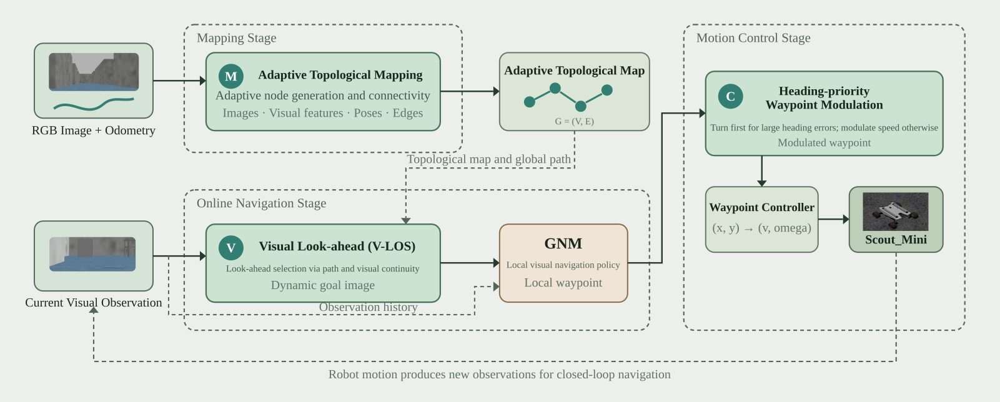
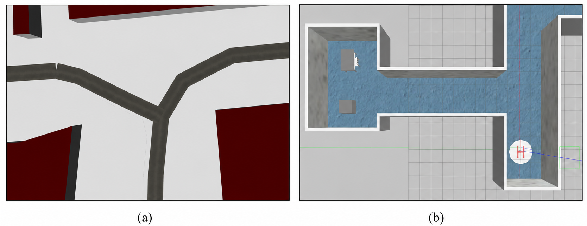
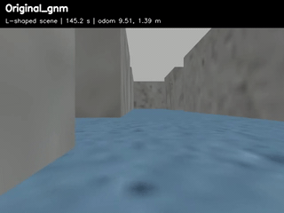
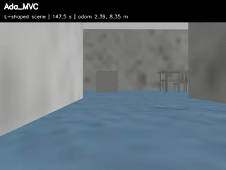

# AdaTopoNav

AdaTopoNav is a visual topological navigation deployment built on the [Visual Navigation Transformer](https://github.com/robodhruv/visualnav-transformer). The deployment adds adaptive topological mapping (M), visual line-of-sight lookahead (V), and heading-prioritized waypoint modulation (C). The original GNM image-sequence route remains available as a baseline. Both routes can use the same GNM checkpoint.

This README covers **ROS Noetic + Gazebo Classic + Scout Mini**. The Scout simulation workspace, Gazebo worlds, model weights, and generated maps are external assets; they are not included in this repository.

## System and simulation scenes

The architecture below shows adaptive mapping (M), visual line-of-sight lookahead (V), and heading-prioritized waypoint modulation (C) around the shared GNM backbone. The [editable SVG source](docs/figures/adatoponav_system_architecture.svg) can be opened in Inkscape.



The paper's simulation scenes are shown below: (a) the Y-shaped multi-branch environment for mapping-efficiency analysis; (b) the L-shaped blind-corner environment for navigation-robustness evaluation.



### L-shaped navigation videos

The animated previews play directly in this README. Click either preview to play the full H.264 recording online; the links use a static CDN because GitHub's repository-file page does not reliably provide a video player for committed MP4 files. These are **one trial per method**, not the paper's 20-trial aggregate. Both used the same pretrained GNM backbone and L-shaped scene; Original GNM used the `L_GNM` image map, while AdaTopoNav used the `L_ours` adaptive graph.

| Method | Video | Result of this recorded trial |
| --- | --- | --- |
| Original GNM | [](https://cdn.jsdelivr.net/gh/helpsds/AdaTopoNav@c12c81b/docs/videos/gnm_l_demo.mp4) | Timeout at 300 s; final goal distance 20.185 m. |
| AdaTopoNav (M+V+C) | [](https://cdn.jsdelivr.net/gh/helpsds/AdaTopoNav@c12c81b/docs/videos/adatoponav_l_demo.mp4) | Success at 235.125 s; 0 collisions; final goal distance 1.621 m. |

If the CDN is unavailable, download the original files from the repository: [Original GNM](docs/videos/gnm_l_demo.mp4) or [AdaTopoNav](docs/videos/adatoponav_l_demo.mp4). The overlays show wall-clock trial time and odometry. Recording samples the camera at up to 5 fps, so video playback duration can be shorter than the elapsed trial time when Gazebo delivers fewer frames.

## 1. Prerequisites and environment

Use Ubuntu 20.04 with ROS Noetic, Gazebo Classic, Conda, and a working Scout Mini Gazebo workspace containing the ROS package `scout_gazebo_sim`. The commands below assume that workspace is at `$HOME/scout_ws`; set `SCOUT_WS` to another path if needed. The optional city-world examples also require a separate Gazebo world/model collection. A GPU is recommended for GNM and DINOv2; the first DINOv2 run may download weights through `torch.hub`.

```bash
sudo apt update
sudo apt install ros-noetic-desktop-full ros-noetic-gazebo-ros-pkgs \
  ros-noetic-teleop-twist-keyboard ros-noetic-joy \
  ros-noetic-ros-control ros-noetic-ros-controllers \
  python3-netifaces python3-defusedxml tmux

git clone --recurse-submodules https://github.com/helpsds/AdaTopoNav.git "$HOME/AdaTopoNav"
export REPO="$HOME/AdaTopoNav"
export SCOUT_WS="$HOME/scout_ws"
cd "$SCOUT_WS"
catkin_make
source /opt/ros/noetic/setup.bash
source "$SCOUT_WS/devel/setup.bash"
rospack find scout_gazebo_sim
```

If `rospack find scout_gazebo_sim` fails, install/build the Scout Gazebo simulation workspace first; this repository does **not** vendor that package. Launch Gazebo from a system-Python shell, not an activated Conda shell: ROS Noetic tools such as `spawn_model` need system modules including `netifaces` and `defusedxml`.

For the inference environment:

```bash
cd "$REPO"
git submodule update --init --recursive
conda env create -f deployment/deployment_environment.yaml
conda activate vint_deployment
pip install -e train/
pip install -e diffusion_policy/
pip install networkx
```

The deployment YAML is the repository's baseline environment specification. If your PyTorch/CUDA driver combination needs different versions, install a compatible PyTorch build in that Conda environment. In each Python/ROS terminal, run:

```bash
source /opt/ros/noetic/setup.bash
source "$SCOUT_WS/devel/setup.bash"
conda activate vint_deployment
export ROS_MASTER_URI=http://localhost:11311
export ROS_HOSTNAME=localhost
export PYTHONPATH="$REPO/train:$REPO/diffusion_policy:$REPO${PYTHONPATH:+:$PYTHONPATH}"
cd "$REPO/deployment/src"
```

Place the downloaded GNM checkpoint at `$REPO/deployment/model_weights/gnm_large.pth`, or change `gnm.ckpt_path` in [deployment/config/models.yaml](deployment/config/models.yaml) to the actual path. Pretrained GNM weights are linked in the [upstream project](https://github.com/robodhruv/visualnav-transformer#pre-trained-models). Do not commit weights, bags, generated maps, or experiment results.

## 2. Start the simulation

In a **separate system-Python terminal**, launch the included CMU indoor world and Scout Mini:

```bash
conda deactivate 2>/dev/null || true
source /opt/ros/noetic/setup.bash
source "$HOME/scout_ws/devel/setup.bash"
export ROS_MASTER_URI=http://localhost:11311
export ROS_HOSTNAME=localhost
roslaunch scout_gazebo_sim scout_mini_playpen.launch \
  world_name:="$(rospack find cmu_worlds)/worlds/indoor.world" \
  spawn_x:=-12 spawn_y:=14 spawn_z:=0.3 spawn_yaw:=1.56
```

The launch file starts Gazebo and spawns the robot; do not start a second `roscore` or another Gazebo instance. Confirm the simulator before mapping/navigation:

```bash
rostopic list | grep -E '^/(camera/color/image_raw|cmd_vel|gazebo/model_states)$'
rostopic info /cmd_vel
rostopic info /odom
```

`/cmd_vel` must have a Gazebo subscriber. If `/odom` has no publisher, start **one** ground-truth bridge in a new ROS/Python terminal:

```bash
cd "$REPO/deployment/src"
python gazebo_model_states_to_odom.py --model-name scout
```

Do not run the bridge when another node already publishes `/odom`. It derives pose from Gazebo `/gazebo/model_states`; it is not wheel odometry. Check `rostopic echo -n 1 /odom` after starting it.

For a custom world, pass its absolute `.world` path as `world_name:=...`. If the world references external models, set `GAZEBO_MODEL_PATH` before `roslaunch`, e.g. `export GAZEBO_MODEL_PATH="$HOME/gazebo_models_worlds_collection/models:$GAZEBO_MODEL_PATH"`. Choose a collision-free spawn pose for that world.

## 3. Build a topological map

First drive the route once, from the intended **start** to the intended **goal**. In another system-ROS terminal:

```bash
source /opt/ros/noetic/setup.bash
source "$HOME/scout_ws/devel/setup.bash"
rosrun teleop_twist_keyboard teleop_twist_keyboard.py
```

Start recording/mapping **before** moving. Use a different map name for each method. For AdaTopoNav, run this in an inference terminal:

```bash
cd "$REPO/deployment/src"
python online_mapper.py --map my_route_ours \
  --image-topic /camera/color/image_raw --odom-topic /odom
```

Drive to the goal, then press Ctrl-C in the mapper terminal to save. The output is `deployment/topomaps/my_route_ours_{vectors,poses,edges}.pt` plus `deployment/topomaps/images/my_route_ours/*.png`. Mapping requires synchronized stamped RGB and `nav_msgs/Odometry` messages. If no nodes are saved, check both topic publishers and their timestamps.

For the **original GNM baseline**, collect only sequential images (no odometry or `.pt` graph):

```bash
cd "$REPO/deployment/src"
python create_toposim.py --dt 1 --dir my_route_gnm \
  --image-topic /camera/color/image_raw
```

Drive the same route and press Ctrl-C at the goal. Images go to `deployment/topomaps/images/my_route_gnm/` as `0.png`, `1.png`, etc. This collector **clears an existing directory with the same map name** when it starts, so use a fresh name or back up the directory first. For rosbag replay, start the collector before `rosbag play`; remap the bag camera to a dedicated topic if Gazebo's live camera is also publishing.

## 4. Navigate

Stop teleoperation before autonomous navigation so it does not compete on `/cmd_vel`. Reset/re-spawn the robot at the mapped start pose. Verify the camera, `/odom` (AdaTopoNav), and the GNM checkpoint. All commands below run from `$REPO/deployment/src` in separate **inference terminals** with the environment from §1.

AdaTopoNav uses three processes. Start the planner first, then the local GNM navigator, then the velocity controller:

```bash
# Terminal A: graph localization and visual lookahead (M + V)
python global_planner.py --dir my_route_ours --goal -1

# Terminal B: GNM waypoint prediction and heading modulation (C)
python navigate_dynamic.py --model gnm --dir my_route_ours --goal-node -1

# Terminal C: publish /cmd_vel from /waypoint
python pd_controller.py
```

`--goal -1` / `--goal-node -1` select the final map node. The planner publishes `/topoplan/target_image`; the navigator publishes `/waypoint`; the controller publishes `/cmd_vel`. The controller also supports collision-recovery parameters; see `python pd_controller.py --help`. Ctrl-C all three when finished. Do not start a second controller at the same time.

To run the original GNM image-sequence baseline instead, **do not run** `global_planner.py` or `navigate_dynamic.py`:

```bash
# Terminal A
python navigate.py --model gnm --dir my_route_gnm --goal-node -1

# Terminal B
python pd_controller.py
```

If the robot does not move, check `rostopic info /waypoint`, `rostopic info /cmd_vel`, model loading errors, and Gazebo pause state. A `/cmd_vel` publisher alone is insufficient: Gazebo must subscribe and the Scout drive plugin/controllers must be active.

## 5. Repeated simulation evaluation

The evaluation runner assumes that Gazebo is **already running**; it resets the Scout pose between trials and writes CSV/logs under `deployment/src/experiment_results/<timestamp>/`. Its defaults are specific to the authors' L-shaped world and maps (`L_GNM`, `L_ours`), so set world-specific start/goal/map variables before using it in another scene. Its default backbone is GNM, 20 trials per method, 240 seconds per trial:

```bash
cd "$REPO/deployment/src"
TRIALS=20 TIMEOUT_SECONDS=240 \
  GNM_MAP=L_GNM ADA_MAP=L_ours \
  bash run_navigation_experiments.sh
```

To record individual trial videos with the same runner, set `RECORD_VIDEOS_DIR` to an output directory and select the desired methods, for example `TRIALS=1 METHODS_CSV=original,ada_mvc RECORD_VIDEOS_DIR="$REPO/docs/videos" bash run_navigation_experiments.sh`. The recorder requires OpenCV (`cv2`) in the inference environment. Its raw output uses `mp4v`; the two linked demos were converted to browser-compatible H.264 with `ffmpeg -i INPUT.mp4 -c:v libx264 -pix_fmt yuv420p -movflags +faststart OUTPUT.mp4`.

`run_y_city_experiments.sh` is the Y-city wrapper: it requires the separately installed `city_osm_roundabout_combined.world` and `bookshelf_large` model and uses the `Y_gnm` / `Y_ours` maps. These experiment scripts include local absolute path defaults for the author's Scout/Conda/world installations; override the documented variables at the top of each script for another machine. Do **not** treat the hard-coded start/goal poses as valid for an arbitrary map.

The experiment evaluator records success, collision-free success, collision count, elapsed time, traveled distance, final-goal distance, angular effort, and in-place rotation; SPL also requires a valid shortest-path distance. Generated trial CSVs are research outputs, not bundled benchmark results.

## Repository layout

- `deployment/src/online_mapper.py`: adaptive RGB–odometry map generation.
- `deployment/src/global_planner.py`: topological planner and visual lookahead.
- `deployment/src/navigate_dynamic.py`: GNM navigation with optional waypoint modulation.
- `deployment/src/navigate.py`: original image-sequence navigation baseline.
- `deployment/src/pd_controller.py`: waypoint-to-`/cmd_vel` controller and optional collision recovery.
- `deployment/src/gazebo_model_states_to_odom.py`: optional Gazebo pose-to-odometry bridge.
- `deployment/config/`: model and robot settings; `train/` and `diffusion_policy/`: upstream model code.

The original training documentation remains in [train/README.md](train/README.md). See [LICENSE](LICENSE) for licensing.
